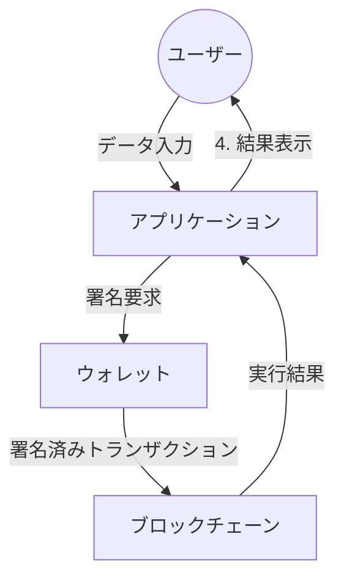

# 【初級編】ブロックチェーンの仕組み

## 🎯 対象読者

作成中

## 💡 この記事を読むとわかること

作成中

## 🧾 この記事のポイント

作成中

## 全体像を理解する：Web3とブロックチェーン

ブロックチェーンの仕組みを理解するために、まずはWeb3アプリケーションの全体像から見ていきましょう。
ブロックチェーンは、この全体像の中で重要な基盤技術として機能しています。

## 分散型アプリケーションとは

分散型アプリケーション（dApp / Decentralized Application）は、**ブロックチェーンに情報を記録することを前提として構築されたアプリケーション**を指します。

### 分散型アプリケーションの構成要素

分散型アプリケーションは、以下の3つの主要な要素で構成されています：

|構成要素|役割|特徴|
|:---|:---|:---|
|**アプリケーション**|・ユーザーインターフェース提供|・Webアプリケーション（フロントエンド） ・ウォレット接続機能|
|**ウォレット**|・ユーザー認証|・トランザクション承認 ・資産管理|
|**ブロックチェーン**|・データの永続化|・分散型台帳 ・データ操作のAPI提供|

### 💡 要素間の連携の流れ

下図は分散型アプリケーションにおける、データの流れを表しています。

## ブロックチェーンの仕組み

### ブロックチェーンの構成要素

|構成要素|主な役割|特徴|具体例|
|:---|:---|:---|:---|
|**トランザクション**|・データの基本単位 ・取引/契約の記録 ・データの真正性保証|・デジタル署名付き ・一度記録されたら変更不可 ・公開台帳に永続的に保存|・暗号資産の送金記録 ・スマートコントラクトの実行 ・NFTの所有権移転|
|**ハッシュ**|・データの一意性保証 ・改ざん検知 ・ブロック間の連結|・固定長の文字列 ・入力が少し変わると大きく変化 ・逆算が実質不可能|・ブロックヘッダーのハッシュ値 ・マークルツリーのルート ・トランザクションID|
|**ノード**|・ネットワーク参加 ・取引の検証 ・データの保持と共有|・分散型で冗長性が高い ・役割に応じた種類がある ・自律的に動作|・フルノード ・マイニングノード ・ライトノード|
|**P2Pネットワーク**|・データの分散共有 ・ノード間の直接通信 ・ネットワークの維持|・中央管理者不要 ・高い耐障害性 ・グローバルに分散|・BitTorrentのような共有 ・ノード間のゴシップ通信 ・分散型台帳の同期|

### 💡 要素間の相互作用

1. **データの流れ**
   - トランザクションの作成 → ネットワークへの伝播 → ノードによる検証
   - 複数トランザクションのブロック化 → ハッシュによる連結 → P2Pネットワークでの共有

2. **セキュリティの確保**
   - デジタル署名（トランザクション）
   - ハッシュチェーン（改ざん防止）
   - 分散合意（P2Pネットワーク）

3. **システムの特徴**
   - 高い透明性（全取引が公開）
   - 改ざん耐性（ハッシュによる検証）
   - 自律分散（P2Pネットワーク）
   - 可用性（ノードの冗長性）

### ブロックチェーンの動作の仕組み

それでは、ブロックチェーンがどのように動作しているのか、その基本的な仕組みについて詳しく解説していきます。
ブロックチェーンは以下の要素が組み合わさることで、安全で改ざんできない分散型のシステムを実現しています。

## よくある質問（初心者編）

作成中

## まとめとこれからの学び方

作成中
