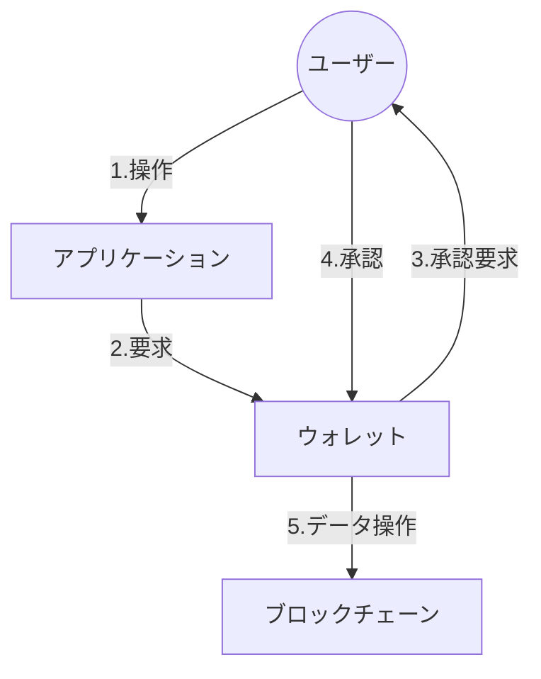

# 【初級編】　ブロックチェーンの仕組み

## 🎯 対象読者

- ブロックチェーンについて基礎から学びたい方
- 分散型アプリケーションの仕組みを理解したい方
- 分散型システムに興味がある方

## 💡 この記事を読むとわかること

- ブロックチェーンの基本的な仕組み
- 分散型アプリケーション（dApp）の全体像
- ブロックチェーンを構成する要素の役割と特徴

## 🧾 この記事のポイント

1. Web3アプリケーションの全体像から理解
2. 分散型アプリケーションの3つの構成要素
3. ブロックチェーンの基本要素（データとネットワーク）

## 全体像を理解する：Web3とブロックチェーン

ブロックチェーンの仕組みを理解するために、まずはWeb3アプリケーションの全体像から見ていきましょう。
ブロックチェーンは、この全体像の中で重要な基盤技術として機能しています。

## 分散型アプリケーションとは

分散型アプリケーション（dApp / Decentralized Application）は、**ブロックチェーンに情報を記録することを前提として構築されたアプリケーション**を指します。

### 分散型アプリケーションの構成要素

分散型アプリケーションは、以下の3つの主要な要素で構成されています：

|構成要素|役割|特徴|
|:---|:---|:---|
|**アプリケーション**|・ユーザーインターフェース提供|・Webアプリケーション（フロントエンド） ・ウォレット接続機能|
|**ウォレット**|・ユーザー認証|・トランザクション承認 ・資産管理|
|**ブロックチェーン**|・データの永続化|・分散型台帳 ・データ操作のAPI提供|

### 💡 要素間の連携の流れ

下図は、分散型アプリケーションで**ブロックチェーンにデータを書き込む際の流れ**です。ユーザーがウォレットで直接承認を行う点が特徴的です。

## ブロックチェーンの仕組み

分散型アプリケーションの構成要素を理解した上で、ブロックチェーンの仕組みの理解に進んでいきましょう！

### ブロックチェーンの構成要素

#### データに関する要素

|構成要素|役割|特徴|
|:---|:---|:---|
|**ハッシュ**|・データの一意性保証 ・ブロック間の連結|・固定長の文字列 ・入力が少し変わると大きく変化|
|**トランザクション**|・データの基本単位 ・取引/契約の記録|・デジタル署名付き ・一度記録されたら変更不可|
|**ブロック**|・トランザクションの集合 ・チェーン構造の構成単位|・ハッシュで連結 ・時系列で管理|

#### ネットワークに関する要素

|構成要素|役割|特徴|
|:---|:---|:---|
|**ノード**|・ネットワーク参加 ・取引の検証|・分散型で冗長性が高い ・役割に応じた種類がある|
|**P2Pネットワーク**|・データの分散共有 ・ノード間の直接通信|・中央管理者不要 ・高い耐障害性|

## よくある質問（初心者編）

- Q. **ブロックチェーンと従来のデータベースの違いは何ですか？**
  - A. 従来のデータベースは特定の組織による中央集権的な管理なのに対し、ブロックチェーンは参加者全員でデータを共有・検証する分散型のシステムです。
- Q. **なぜウォレットが必要なのですか？**
  - A. ブロックチェーンへの操作には必ずユーザーの承認が必要で、ウォレットはその承認を安全に行うための重要なツールです。
- Q. **データを書き込むのに手数料が必要なのはなぜですか？**
  - A. ブロックチェーンの処理には計算リソースが必要で、その対価としてノード運営者への報酬とスパム防止を目的に手数料が設定されています。
- Q. **ブロックチェーンに書き込んだデータは修正できないのですか？**
  - A. データの信頼性を担保するため、一度書き込まれたデータは修正できず、必要な場合は新しいデータを追加する形で対応します。

## まとめとこれからの学び方

- 基本的な概念の復習
- 実際のdAppを使ってみることの推奨
- より詳しく学ぶためのリソース紹介
